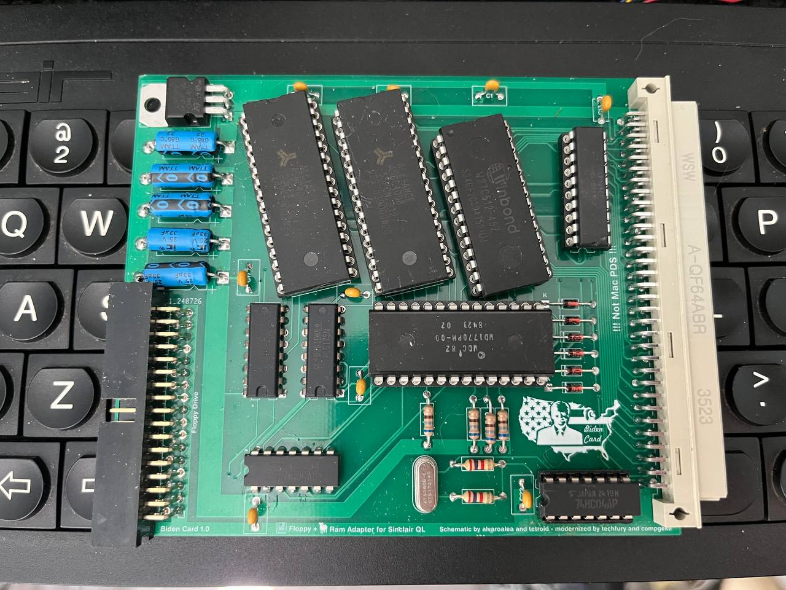

# Biden Card
Partially cost reduced/modernized Sinclair QL Trump Card clone with bonus Dark Brandon meme.

# Background
I originally started this project in late 2023 because real Trump Cards were getting difficult to obtain, and I wanted one for my QLs. 

Alvaro had previously successfully cloned the board, but there were timing-related issues with substituting the PALs for GALs. Analysis of the situation revealed that the issue related to DRAM control timing. Since 41256 DRAM is no longer made, I decided to move to AS6C4008 4mbit SRAM. The resulting logic simplification also eliminated the need for GAL 2, and paring down GAL 1's DRAM-related functions allowed me to fit the new SRAM decode logic into GAL 1, thereby eliminating GAL 2 entirely. 

The end result is 100% compatible with the Trump Card, but only costs about $50 USD to manufacture.

This design is a bit quick/rudimentary/slapdash- in particular, these low-hanging fruits exist for optimization: 
- Replace DIP AS6C4008s with suitable SMD SRAM. Do note that I grounded out OE (output enable) and use only CS to access the SRAM- most SRAMs can handle this but please check the datasheet!
- Redo axial caps with radials (this was really just cargo-culted from the original design to get a viable prototype working quickly)
- Replace 7805 with a more efficient regulator (even with the 7805, however, power consumption is a fraction of the original Trump Card!)

# Credits
- Alvaro Alea for reverse engineering the Trump Card 2 schematic (the basis of this project)
- Tetroid for reverse engineering the PAL/GAL logic equations. His equations were the basis of mine, particularly in regards to the P13/P16 ROM shadowing bodge needed to make pre-Minerva ROMs recognize the ROM.
- Compgeke for doing the PCB layout (I have not quite honed that skill yet... this is my first DIY PCB project of this scale!)
